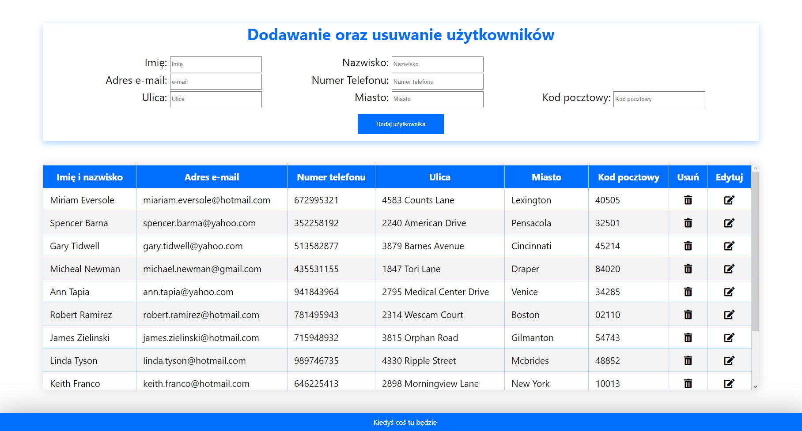

# smaller-projects
Zbiorowisko mniejszych projektów

<h1>Dodawanie oraz usuwanie użytkowników</h1>
Aplikacja pozwala na:
<ul>
  <li>Dodawanie użytkowników do bazy danych poprzez wypełnienie formularza</li>
  <li>Usuwanie użytkowników z bazy danych</li>
  <li>Edytowanie danych zapisanych użytkowników poprzez formularz</li>
  <li>Tabela z wszystkimi zarejestrowanymi użytkownikami</li>
</ul>

